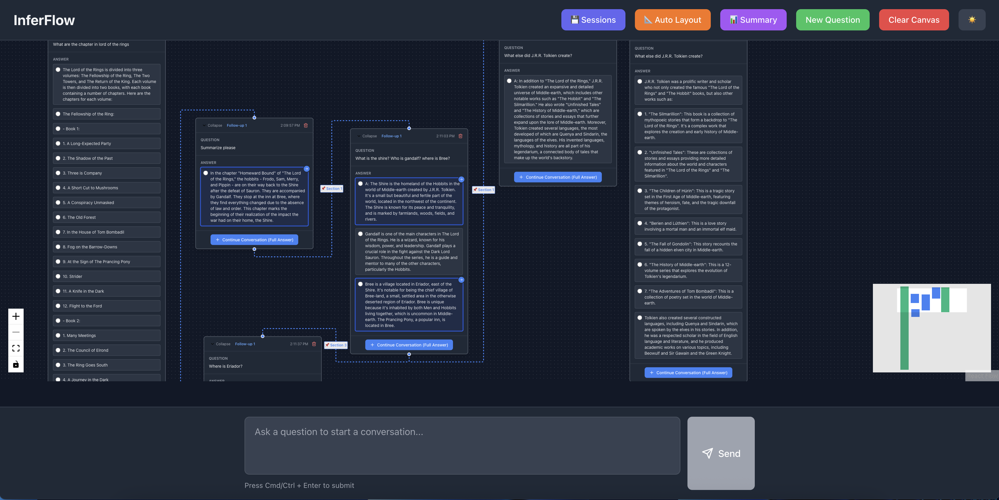

# InferFlow

[](https://github.com/David-Hoa2023/Interflow/actions/workflows/ci.yml)
[](https://github.com/David-Hoa2023/Interflow/actions/workflows/code-quality.yml)

An infinite canvas application for managing branching LLM conversations with context-aware chat spawning and summarization capabilities.



## Features

- 🎨 **Infinite Canvas** - Visualize conversations as nodes on an infinite canvas
- 💬 **Single Inference Window** - Ask questions from one central input
- ➕ **Branch Conversations** - Click "+" on any answer to spawn a new conversation branch
- 🔗 **Context Awareness** - Each new conversation includes full context from parent chain
- 💾 **Local Persistence** - Conversations saved to localStorage
- 🌓 **Dark/Light Theme** - Toggle between themes
- 📦 **Collapsible Nodes** - Collapse/expand conversation nodes
- 🔄 **Auto-layout & Manual** - Drag nodes or let them auto-position
- 🤖 **Multi-Model Support** - Use OpenAI, Anthropic Claude, or Google Gemini
- 📝 **Rich Media** - Code syntax highlighting, markdown rendering, images, and links
- ✅ **Selective Context** - Choose which nodes to include in conversation context
- ⭐ **Bookmarks** - Bookmark important nodes for quick access
- 🧭 **Breadcrumb Navigation** - Visual path from root to current node
- 🎯 **Path Highlighting** - Highlight conversation chains on the canvas
- 🔍 **Search** - Full-text search across all conversations

## Getting Started

### Prerequisites

- Node.js 18+ and npm

### Installation

1. Install dependencies:
```bash
npm install
```

2. Set up your OpenAI API key:
   - Create a `.env` file in the root directory
   - Add your API key:
   ```
   VITE_OPENAI_API_KEY=your_api_key_here
   ```

3. Start the development server:
```bash
npm run dev
```

4. Open your browser to the URL shown (typically `http://localhost:5173`)

## Usage

1. **Ask a Question**: Type your question in the inference window at the bottom and press Send (or Cmd/Ctrl + Enter)

2. **Branch Conversations**: Click the "+" button on any answer to start a new conversation branch with that context

3. **Navigate Canvas**: 
   - Drag nodes to reposition them
   - Use zoom controls in the bottom-right
   - Use minimap in the bottom-left

4. **Collapse Nodes**: Click the chevron icon in the node header to collapse/expand

5. **New Question**: Click "New Question" in the header to start a fresh conversation

6. **Toggle Theme**: Click the sun/moon icon to switch between light and dark themes

## Project Structure

```
src/
├── components/
│   ├── canvas/          # Canvas and node components
│   └── inference/       # Inference window component
├── services/
│   └── llm/            # LLM service and providers
├── store/               # Zustand state management
├── types/               # TypeScript type definitions
└── utils/               # Utility functions
```

## Tech Stack

- **React 18** - UI framework
- **TypeScript** - Type safety
- **Vite** - Build tool
- **React Flow** - Infinite canvas
- **Zustand** - State management
- **Tailwind CSS** - Styling
- **OpenAI SDK** - GPT models integration
- **Anthropic SDK** - Claude models integration
- **Google Generative AI** - Gemini models integration
- **React Markdown** - Markdown rendering
- **React Syntax Highlighter** - Code syntax highlighting

## Implemented Features

- ✅ **Session Management** - Save, load, export, and import conversation sessions
- ✅ **Auto Layout** - Automatically organize nodes in a hierarchical tree layout
- ✅ **Summary View** - Generate and export conversation summaries
- ✅ **Node Management** - Delete nodes and assign human-readable names
- ✅ **Section Selection** - Select specific sections of answers for context
- ✅ **Export/Import** - Save sessions to JSON files and load them elsewhere
- ✅ **Multi-Model Support** - OpenAI (GPT), Anthropic (Claude), Google (Gemini)
- ✅ **Rich Media Rendering** - Markdown, code highlighting, images, links
- ✅ **Selective Context** - Include/exclude nodes from conversation context
- ✅ **Navigation** - Breadcrumbs, bookmarks, path highlighting
- ✅ **Search** - Full-text search with filtering by type and model
- ✅ **CI/CD Pipeline** - Automated testing, building, and deployment

## Future Features

- [ ] Backend & Database (Supabase integration)
- [ ] Conversation templates library
- [ ] Enhanced export formats (PDF, PNG, presentations)
- [ ] Real-time collaboration
- [ ] Performance optimization (virtual rendering, lazy loading)
- [ ] Testing infrastructure (unit, integration, E2E tests)
- [ ] Advanced analytics and insights
- [ ] Version control for conversation trees

## License

MIT

